# 행사장 배치도 안전 검증 솔루션 - 시스템 다이어그램

## 1. 전체 서비스 흐름도 (High-Level)

## 2. 상세 데이터 흐름도

```mermaid
flowchart LR
    subgraph STEP1["STEP 1: 데이터 수집"]
        A1[고객 업로드:<br/>배치도 이미지]
        A2[고객 업로드:<br/>안전규정 PDF]
    end

    subgraph STEP2["STEP 2: 데이터 변환"]
        B1["이미지 → 구조화 데이터<br/>─────────────────<br/>• 부스: {id, x, y, width, height}<br/>• 무대: {id, x, y, height}<br/>• 출구: {id, x, y, type}<br/>• 통로: {id, width, path}"]

        B2["PDF → 검증 규칙<br/>─────────────────<br/>• 이격거리 규칙<br/>• 높이 제한 규칙<br/>• 위치 제한 규칙<br/>• 필수 설비 규칙"]
    end

    subgraph STEP3["STEP 3: 검증 수행"]
        C1["각 규칙 × 각 객체<br/>순회 검증"]
    end

    subgraph STEP4["STEP 4: 결과 생성"]
        D1["✅ 통과 항목"]
        D2["❌ 미통과 항목<br/>+ 위반 사유<br/>+ 해당 위치"]
    end

    A1 --> B1
    A2 --> B2
    B1 --> C1
    B2 --> C1
    C1 --> D1
    C1 --> D2
```

## 3. 이미지 분석 상세 흐름

## 4. 검증 엔진 상세 흐름

## 5. 개발 로드맵 (1차 → 2차)

## 6. 시스템 컴포넌트 구성 (개발팀용)

---

## 다이어그램 설명

### 핵심 처리 흐름
1. **입력**: 고객이 배치도 이미지와 안전규정 PDF를 업로드
2. **이미지 분석**: 배치도에서 객체(부스, 무대, 출구 등) 인식 + 좌표/거리/면적 수치 추출
3. **PDF 파싱**: 안전규정 문서에서 검증 항목을 구조화된 규칙으로 변환
4. **AI 검증**: 추출된 데이터를 모든 규칙에 대해 검증
5. **출력**: 통과/미통과 항목과 위반 사유를 포함한 리포트 생성

### 기술 스택 제안
- **이미지 분석**: Python + OpenCV + YOLO/Faster R-CNN
- **PDF 파싱**: Python + pdfplumber/PyPDF2
- **백엔드 API**: Spring Boot 또는 FastAPI
- **AI/LLM**: 규칙 해석 및 개선 제안 생성
- **데이터베이스**: PostgreSQL/MySQL
- **파일 저장**: S3 또는 MinIO
